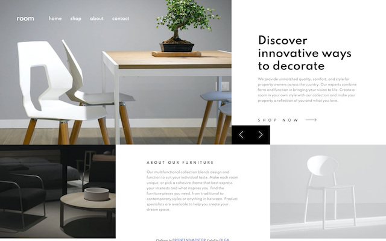

# Frontend Mentor - Room homepage solution

This is a solution to the [Room homepage challenge on Frontend Mentor](https://www.frontendmentor.io/challenges/room-homepage-BtdBY_ENq). Frontend Mentor challenges help you improve your coding skills by building realistic projects. 

## Table of contents

- [Frontend Mentor - Room homepage solution](#frontend-mentor---room-homepage-solution)
  - [Table of contents](#table-of-contents)
  - [Overview](#overview)
    - [The challenge](#the-challenge)
    - [Screenshot](#screenshot)
    - [Links](#links)
  - [My process](#my-process)
    - [Built with](#built-with)
    - [What I learned](#what-i-learned)
    - [Continued development](#continued-development)
    - [Useful resources](#useful-resources)
  - [Author](#author)

## Overview

### The challenge

Users should be able to:

- View the optimal layout for the site depending on their device's screen size
- See hover states for all interactive elements on the page
- Navigate the slider using either their mouse/trackpad or keyboard

### Screenshot

### Links

- Live Site URL: [Room Homepage on Vercel](https://fementor-room-homepage-ialsowalkdogs.vercel.app)

## My process

### Built with

- Semantic HTML5 markup
- SCSS
- Flexbox
- Mobile-first workflow
- Parcel
- Deployed to Vercel

### What I learned

This was a nice refresher for building a mobile-first layout. Even with previous experience, sometimes it takes time and effort to make elements play nicely together! 

### Continued development

- Would be nice to add some fun transitions to the carousel

### Useful resources

- [CSS filter generator](https://codepen.io/sosuke/pen/Pjoqqp) - I used this to color the SVG on hover in carousel links. 

## Author

- Website - [Olga Vorozheykina](https://ialsowalkdogs.dev/)
- Frontend Mentor - [@berrybell](https://www.frontendmentor.io/profile/berrybell)
- Twitter - [@ialsowalkdogs](https://www.twitter.com/ialsowalkdogs)